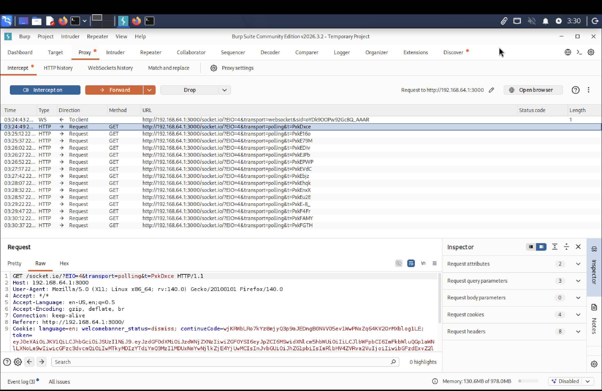
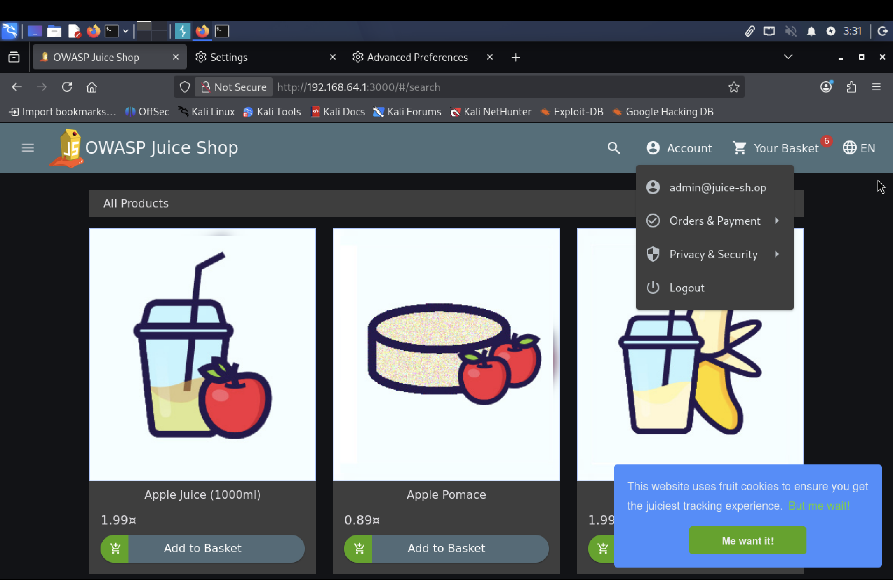
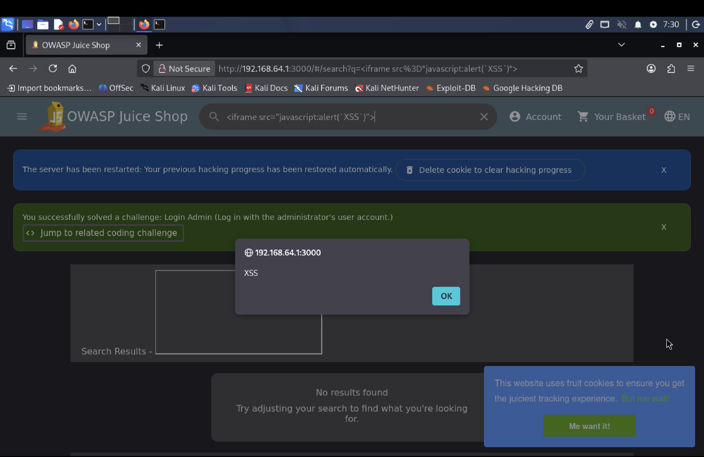
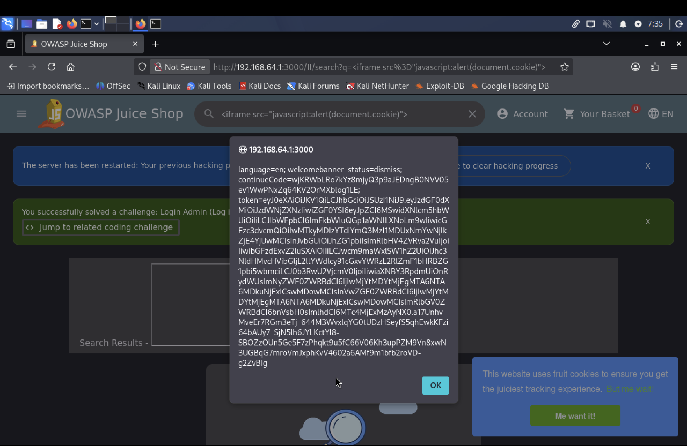

# Vulnerability Lab 1: Web Application Authentication Bypass via SQL Injection

## Project Overview
This project demonstrates the configuration of a containerized application environment and the execution of a server-side authentication bypass using structured query language injection (SQLi). The objective was to identify flaws within user login mechanisms and document how attackers manipulate backend database queries.

## Environment Architecture
- **Host OS:** macOS (Apple Silicon Architecture)
- **Container Runtime:** Docker Engine (serving OWASP Juice Shop on Port 3000)
- **Virtualization Layer:** UTM Virtual Machine running Kali Linux ARM64
- **Network Routing:** Manual Loopback Proxy Configuration (127.0.0.1:8080)
- **Interception Proxy:** Burp Suite Community Edition

---

## Technical Walkthrough & Execution

### 1. Traffic Interception Setup
Because the built-in browser engine was restricted due to sandboxing constraints on ARM64 Linux, traffic routing was achieved manually. 
- Configured native Kali Firefox network preferences to output traffic to local port `8080`.
- Modified the browser configuration parameters (`about:config`) to enable `network.proxy.allow_hijacking_localhost = true`, ensuring internal virtual machine data could be audited.

### 2. Identifying the Flaw
Navigated to the application login panel. The backend authentication mechanism handles input parsing unsafely, making it susceptible to SQL structure manipulation.

### 3. Exploitation & Payload Deployment
Activated Burp Suite's Intercept mechanism and submitted the following payload into the email fields:
- **Payload:** `' OR 1=1--`
- **Password:** `random_password`

#### Intercepted HTTP Request:
POST /rest/user/login HTTP/1.1
Host: 192.168.1.5:3000
Content-Type: json/application

{"email":"' OR 1=1--","password":"random_password"}

### 4. Vulnerability Mechanics
The backend application processes the string inside a template query similar to this:
`SELECT * FROM Users WHERE email = '' OR 1=1--' AND password = '...';`

The standalone single quote `'` forces an early termination of the targeted input parameter. The condition `OR 1=1` introduces a logical operator that evaluates to true for every single row in the SQL database. The double-dash `--` tells the database processor to disregard the entire trailing sequence (nullifying the required password parameter entirely). 

Because the administrator record is typically the first entry fetched (`ID: 1`), the database authenticates the request as the administrator user.

---

## Results & Verification
Upon forwarding the modified packet, the server responded with a session token. The application home panel updated, demonstrating a successful privilege escalation and complete authentication bypass as user: `admin@juice-sh.op`.

## Results & Verification
Upon forwarding the modified packet, the server responded with a session token. The application home panel updated, demonstrating a successful privilege escalation and complete authentication bypass as user: `admin@juice-sh.op`.

### Evidence of Exploitation
**1. Intercepted SQL Injection Payload in Burp Suite:**

**2. Successful Authentication Bypass as Administrator:**

---

# Vulnerability Lab 2: Client-Side Code Execution via Reflected Cross-Site Scripting (XSS)

## Project Overview
This lab demonstrates the identification and exploitation of a Reflected Cross-Site Scripting (XSS) vulnerability within an application's search functionality. The objective was to input an executable JavaScript payload to bypass input validation controls and achieve unauthorized client-side code execution.

## Technical Walkthrough & Execution

### 1. Identifying the Injection Vector
Navigated to the application search feature. The search bar takes user strings and renders them directly onto the web page interface without sanitizing HTML tags or stripping JavaScript hooks.

### 2. Payload Construction & Deployment
Injected a customized HTML `<iframe>` payload designed to trigger a native JavaScript alert dialogue box upon render:
- **Payload:** `<iframe src="javascript:alert(`XSS`)">`

### 3. Vulnerability Mechanics & Weaponization
Because the backend lacks strict output encoding, the browser parses the text input as executable HTML elements. While a standard `alert('XSS')` string proves execution, the flaw was weaponized by executing `document.cookie`. 

This grants direct access to the client's session storage. In a real-world scenario, this script would silently exfiltrate these session tokens to an external command-and-control (C2) server, allowing an attacker to completely bypass authentication and hijack the user's session.

## Results & Verification
Upon execution, the application instantly rendered the alert modal confirming arbitrary script execution. 

### Evidence of Exploitation
**Reflected XSS Execution Verification:**

**Session Cookie Extraction via Reflected XSS:**

